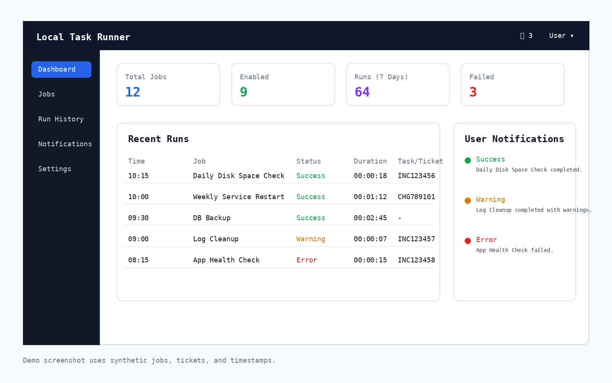

# automation-runners

Tools for recurring local automation, scheduled script runs, dashboards, and run history.

This category is for tools that are more than a one-shot script, but still should stay local/internal rather than becoming internet-facing services.

## Included tool

### local_task_runner.py

Local dashboard for scheduling recurring script runs and tracking run history.

I built this around a practical infrastructure/support reality: not every corporate or lab environment uses Jira, Azure DevOps, ServiceNow, or another modern ticketing platform for every recurring operational task. Sometimes teams still need a simple way to run approved scripts on a schedule, keep run history, and capture task/ticket references from script output.



What it does:

- runs local Python, PowerShell, CMD/Batch, or custom command-template jobs
- stores jobs and run history in SQLite
- uses APScheduler for scheduling
- captures stdout/stderr
- extracts ticket/task references from output
- provides a local FastAPI dashboard

## Install

```bash
pip install -r requirements.txt
```

or:

```bash
pip install fastapi uvicorn apscheduler python-multipart
```

Optional, only if your scheduled scripts use internal HTTP/Kerberos APIs:

```bash
pip install requests urllib3 requests-kerberos
```

## Run

```bash
python local_task_runner.py
```

Open:

```text
http://127.0.0.1:8080
```

## Optional local protection

Windows CMD:

```cmd
set LOCAL_TASK_RUNNER_TOKEN=choose-a-long-random-token
```

PowerShell:

```powershell
$env:LOCAL_TASK_RUNNER_TOKEN="choose-a-long-random-token"
```

Then open the URL printed by the app.

## Safety notes

- Keep the host as `127.0.0.1` unless you add proper authentication, TLS, and network controls.
- Use only for scripts and systems you are authorized to operate.
- This is a local/internal automation helper, not a production ticketing system.
