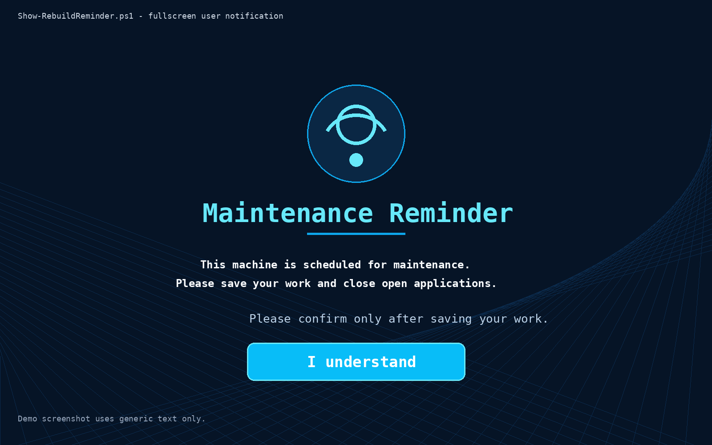
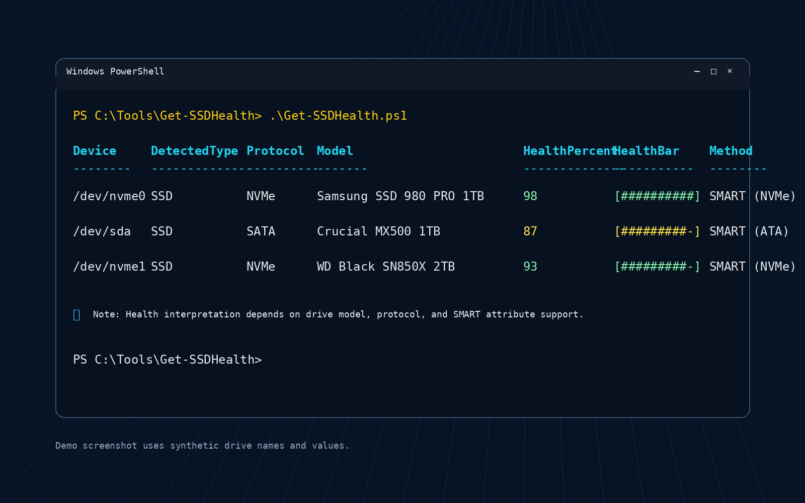

# local-endpoint-executions

Tools intended to run directly on the target machine.

Some of these are simple health checks. Others may affect the local machine, so the script name and notes should make the action clear.

## Included tools

### Show-RebuildReminder.ps1

Shows a fullscreen user-facing reminder before scheduled maintenance, rebuild, shutdown, or another disruptive action.

It should run inside the logged-in user's interactive session. Session 0 cannot display this UI to the user.

### Get-SSDHealth.ps1

Shows a compact local SSD health summary using `smartctl` from smartmontools.

Useful when checking drive health quickly from a local endpoint, especially before maintenance, replacement, or troubleshooting.

### reset-network-and-reboot.cmd

Resets local network state and schedules a reboot.

This one is intentionally disruptive. Run it only on a machine you are authorized to maintain.

## Notes

These tools are local endpoint helpers, not remote management frameworks.
