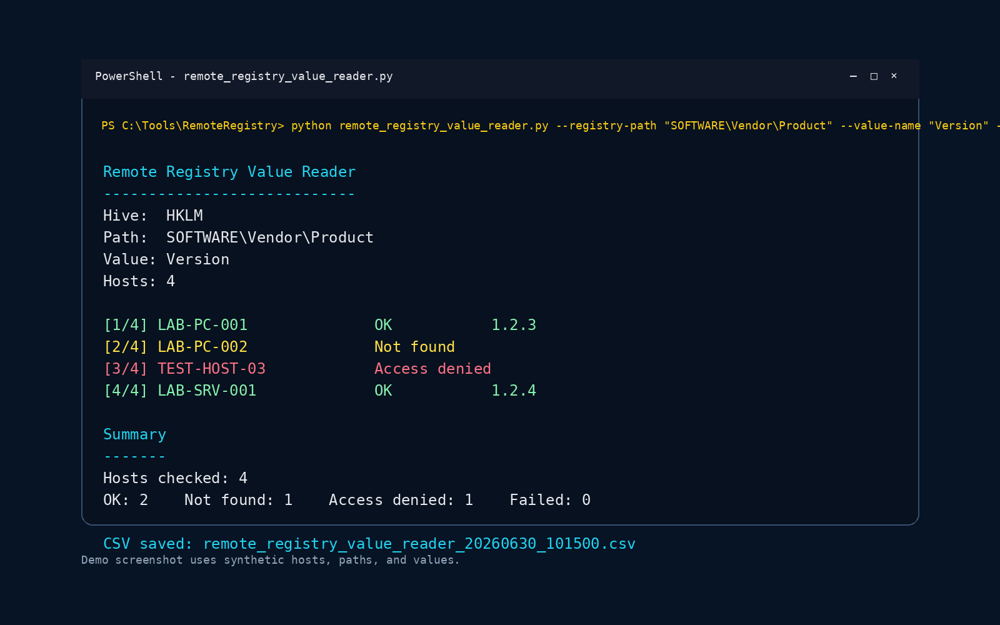

# remote-endpoint-executions

Tools used from my workstation against authorized remote endpoints.

The idea is to make repeated checks easier when working with several machines, especially in support or lab-style environments.

## Included tools

### remote_pnp_device_search.py

Checks whether a Plug and Play device is currently present on multiple authorized remote Windows hosts.

Useful when you need to know which machines detect a specific USB, network, serial, or debug device without opening Device Manager manually on each one.

```powershell
python remote_pnp_device_search.py --identifier ASIX --hosts hosts.txt
```

### remote_registry_value_reader.py

Reads one registry value from multiple authorized remote Windows hosts.

Useful when the same registry value needs to be checked across several machines.

```powershell
python remote_registry_value_reader.py `
    --registry-path "SOFTWARE\Vendor\Product" `
    --value-name "Version" `
    --hosts hosts.txt
```



## Notes

Use these only where you have permission to query or administer the target machines.

Examples use fake hostnames and generic registry paths.
